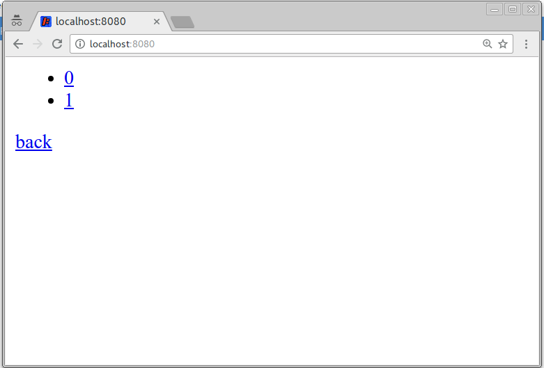
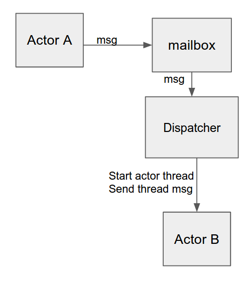
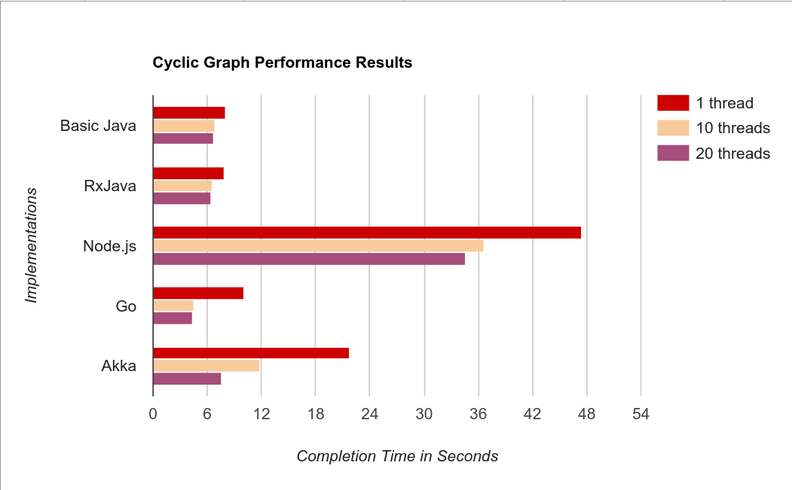

# Concurrency Comparison
   All resources mentioned in this blog can be accessed from our repository: 
   <https://github.com/Gigaspaces/concurrency-comparison>

## Motivation
Here at Gigaspaces we put a lot of thought and afford to make sure our entire R&D team produces professional and 
efficient code. By the nature of our distributed product the code, more often than not, needs to be concurrent. So to 
keep up with all things concurrent and scalable we decided to write the same app in a variety of programming languages 
and frameworks so we can compare and contrast the different implementations.

Here are criteria that we chose to consider:

 * Multi-Core Utilization -- does the technology support Multi-Core Utilization without changing the program ? 
 * Abstraction Level -- How much is the business logic code is separate and independent from concurrency related code? 
 * Easy To Master -- How much time does it take to learn this technology ?
 * Readability -- Does it easy to read others code? does it easy to read my code after a year ? 
 * Performance.
 * Additional Features -- Other goodies provided by this technology that does not fall into one of the above.


The program we chose to use as the comparator is a web crawler, its purpose is to traverse an html pages hierarchy and for every link (href) in a page, 
fetch the page, extract its link and process them. The most potentially time consuming part of the execution is the remote http
request and the parsing of the page and that is why this is the part we are paralleling.
We execute each test with parallelism level set to 1, 10 and 20.   

## The Testing Tool
In order to test the results of each implementation we created the fake web tree - a go web server that generates a tree
of pages of a requested depth on demand.
In order to run the tool you need to have the go language installed on your computer. Build the project by running 
concurrency-comparison/fake-web-tree/build.sh and run fake-web-tree/bin/fake-web-tree.sh -depth=16 -graph 
(we use depth 16 for our benchmarking but you can create a graph of any size).
You can check that http://localhost:8080 looks like this:

   

It is also possible to run the fake-web-tree in a docker. To deploy a fake-web-tree docker run the script 
./fake-web-tree/docker/graph.sh.

## The Basic java implementation:
This implementation is set up as a maven project that you can build and run conveniently from your IDE.
Here we are using a thread pool to execute the task of extracting links from a given page. _pending_ is an atomic integer
used to keep track of how many urls are being visited and the ‘seen’ set is used for memoization.

```java
public class Crawler {

    private ConcurrentHashMap<String, Boolean> seen = new ConcurrentHashMap<String, Boolean>();
    private AtomicInteger pending = new AtomicInteger(0);
    
    public Crawler(String baseUrl, int numOfThreads) {
        this.client = HttpClientBuilder.create().build();
        this.baseUrl = baseUrl;
        this.executorService = Executors.newFixedThreadPool(numOfThreads, new ThreadFactory() {
           public Thread newThread(Runnable r) {
               return new Thread(r, "Crawler-Worker");
            }
        });
    }
    
    public void start() {
        handle(baseUrl);
    }
    
    private void handle(final String link) {        
       if (seen.containsKey(link))
           return;
       seen.put(link, true);
       pending.incrementAndGet();
       executorService.execute(new Runnable() {
           public void run() {
               List<String> links = getLinksFromUrl(link);
               for (String link : links) {
                   handle(link);
               }
               pending.decrementAndGet();
               if (pending.get() == 0) {
                   synchronized (lock) {
                       lock.notify();
                   }
               }
           }
       });
    }
}
public class Main{
public static void main(String[] args) throws InterruptedException {
    if (args.length != 2) {
        System.err.println("Invalid syntax: <baseUrl> <numOfThreads>");
        System.exit(1);
    }
    String baseUrl = args[0];
    int numOfThreads = Integer.parseInt(args[1]);
    System.out.println("Using " + numOfThreads + " threads to process " + baseUrl);
    Crawler crawler = new Crawler(baseUrl, numOfThreads);
    long start = System.currentTimeMillis();
    crawler.start();
    crawler.join();
    long totalTimeInMS = System.currentTimeMillis() - start;
    crawler.shutdown();
    System.out.println(crawler.getSeenLinks() + " links processed in " + (double) totalTimeInMS / 1000 + "s");
}
}
```
    output: 
       Using 20 threads to process http://localhost:8080
       65537 links processed in 6.664s

The java implementation is straightforward and dose not involve learning any new technology, however, readability is low.
We have to use ConcurrentHashMap and AtomicInteger to avoid race conditions and to use a lock and synchronized blocks in
order to write concurrent, thread safe code and every time we explicitly write synchronize pieces of code the chances of
bugs increases. Java maps every java thread directly to an OS thread, so the parallelism level in this program is determined
by the number of threads in the `ExecutorService`.
  

## The RxJava implementation
RxJava is a Java implementation of ReactiveX, A library for composing asynchronous and event-based programs by using 
observable sequences. An observer subscribes to an Observable and then that observer reacts to whatever item or sequence
of items the Observable emits. This pattern supports concurrent operations because it is non-blocking when waiting for 
the Observable to emit objects. Instead of blocking we create a guard in the form of an observer that stands ready to 
react when the Observable eventually emits some item or sequence of items.
The client subscribe to the observable and blocks on  the completionLatch until completion:
```java
public class CrawlerClient {
   public CrawlerClient(Crawler crawler, String url, int numOfThreads) {
       this.observable = ObservableCrawler.create(crawler, url, numOfThreads);
       observable.subscribe(this::onNext, this::onError, this::onCompleted);
   }
   public void waitForCompletion() throws InterruptedException {
       completionLatch.await();
   }
}
```
Here we are creating an Observable using a constructor which receives an implementation of Observable.OnSubscribe 
interface. This implementation defines what action will be taken when a subscriber subscribes to the Observable, 
in our action, if numOfThreads > 0, the processAsync method will be called. When processAsync is called for some url 
a new task is submitted, the task calls the webCrawler crawl method which extracts the links and calls back processAsync
for every such url.

```java
public class ObservableCrawler {
   private Subscriber<? super String> subscriber;
   
   public static Observable<String> create(Crawler crawler, String url, int numOfThreads) {
       ObservableCrawler o = new ObservableCrawler(crawler, numOfThreads);
       return Observable.create(subscriber -> {
           o.subscriber = subscriber;
           if (o.executorService == null) {
               o.process(url);
               subscriber.onCompleted();
           } else {
               o.processAsync(url);
           }
       });
   }
   private ObservableCrawler(Crawler crawler, int numOfThreads) {
       this.crawler = crawler;
       this.executorService = numOfThreads > 0 ?
               Executors.newFixedThreadPool(numOfThreads, r -> new Thread(r, "Crawler-" + threadIdGenerator.incrementAndGet()))
               : null;
   }
   
   private void processAsync(String url) {
          pendingTasks.incrementAndGet();
          executorService.submit(() -> {
              // If item is not unique, skip processing
              boolean isFirstTime =  results.add(url);
              if (isFirstTime) {
                  subscriber.onNext(url);
                  crawler.crawl(url, this::processAsync);
              }
              if (pendingTasks.decrementAndGet() == 0) {
                  subscriber.onCompleted();
                  executorService.shutdown();
              }
          });
   }
}
```

from the application side:
```java
public class CrawlersDemo {
    private static void demoWebCrawler(String url) throws InterruptedException {
        Crawler crawler = new WebCrawler(url);
        CrawlerClient crawlerClient = new CrawlerClient(crawler, "/" , 20);
        crawlerClient.waitForCompletion();
    }
}
```
    output:
        [main] *** Testing WebCrawler with http://localhost:8080 *** 
        [Crawler-12] Completed - duration = 6.459s
    
We clearly see that this implementation performs as well as the previous one, this make sense because both uses the same
executor service (thread pool). It is also worth mentioning that, as in the previous implementation, atomic variables 
are use to allow for concurrent execution with no race conditions. However the rx library handles the synchronization 
and thread scheduling for you behind the scenes and all you have to do is implement the onNext/ onError/ onCompleted 
methods in a thread safe manner.
Again no magic here - each java thread is mapped directly to an OS thread and the parallelism level in determined by the
number of threads in the `ExecutorService`.

Additional benefits of observable:
* **Observables Are Composable:**  ReactiveX Observables are intended for composing flows and sequences of asynchronous
data.
* **Observables Are Flexible:** Observable is a single abstraction that can be used for the emission of single values, 
sequences of values or even infinite streams.
* **Observables Are Less Opinionated:** ReactiveX is not biased toward some particular source of concurrency or 
asynchronicity. 

## The Go implementation
Go is a very small and simple language that is very easy to learn, it is has strong types but does not support generics.
Functions are first class object but the language does not encourage functional programming style.
Go is a general-purpose language developed by google and it was designed to get the most out of multi-core and networked
machines. It is strongly typed and garbage-collected and has explicit support for concurrent programming like goroutines
and channels. A goroutine is a lightweight thread managed by the Go runtime and channels are a typed conduit through 
which you can send and receive values, by default sends and receives block until the other side is ready and they can 
also be buffered.

To run this example, make sure you have go installed, you can find all you need here: <https://golang.org/dl/>.
Then use golang/web-crawler/build.sh to build the example 
and golang/web-crawler/bin/web-crawler http://localhost:8080 to run it.

```go
package main

import (
	"log"
	"github.com/barakb/web-crawler/links"
	"runtime"
	"time"
	"net/http"
	"flag"
)

var tokens chan struct{}

func crawl(url string) []string {
	tokens <- struct{}{} // acquire a token
	list, err := links.Extract(url)
	<-tokens // release the token

	if err != nil {
		log.Print(err)
	}
	return list
}

func main() {
	goroutinesPtr := flag.Int("goroutines", 20, "number of concurrent goroutines")
	flag.Parse()
	http.DefaultTransport.(*http.Transport).MaxIdleConnsPerHost = 100
	runtime.GOMAXPROCS(runtime.NumCPU())
	tokens =  make(chan struct{}, *goroutinesPtr)
	log.Printf("using %d goroutines to process %q\n", *goroutinesPtr, flag.Args())
	worklist := make(chan []string)
	var n int // number of pending sends to worklist

	start := time.Now()

	// Start with the command-line arguments.
	n++
	go func() { worklist <- flag.Args() }() // goroutine that blocks until the first url is fetched 

	// Crawl the web concurrently.
	seen := make(map[string]bool)
	for ; n > 0; n-- {
		list := <-worklist
		for _, link := range list {
			if !seen[link] {
				seen[link] = true
				n++
				go func(link string) {     //the goroutine
					worklist <- crawl(link)
				}(link)
			}
		}
	}
	elapsed := time.Since(start)

	log.Printf("%d links processed in %s\n", len(seen), elapsed)
}
```
    output:
        using 20 goroutines to process ["http://localhost:8080"]
        65535 links processed in 4.002921664s

flag is the standard library for command-line flag parsing, here we declare an int flag, goroutines, with a default value 20 
and a short description. Once all flags are declared, call flag.Parse() to execute the command-line parsing and then use
the flag directly. for example, running 'web-crawler -goroutines=10 http://localhost:8080' will use only 10 goroutines 
in the execution, if left unspecified the default value 20 will be used. 
_tokens_ is a channel that is intended to mutex the crawl method critical section and _worklist_ is a buffered channel 
of lists of links to process. it also serves as a countdown latch that determines how many goroutines will be executed 
simultaneously. The loop for link := range list receives values from the channel repeatedly until it is closed.
You can explore the links.Extract method [here](https://github.com/Gigaspaces/concurrency-comparison/tree/master/golang/web-crawler/src/github.com/barakb/web-crawler/links)

Goroutines are just logical threads and go maps a group of logical threads into a group of OS threads.
The number of OS threads used by this program is determined by the statement `runtime.GOMAXPROCS(runtime.NumCPU())` that
set it to the number of CPU's on the machine.
So, we can see that channels allows goroutines to synchronize without explicit locks or condition variables and the 
performance of this implementation is significantly batter then the previous ones, that is because goroutines are much
more efficient then java threads in memory consumption, setup,teardown and switching costs.
Here the parallelism level is limited by the size of the buffer in the channel `tokens`.    

## The Node.js implementation

In order to run this on your computer you need to have Node.js installed, check it out [here](https://nodejs.org/en/) 
and also some javascript building tool, we are using [npm](https://docs.npmjs.com/cli/install).
Use _npm install_ command from the Node.js folder to build and _nodejs web-crawler.js_ to run.   

Node is an asynchronous event driven JavaScript runtime that is designed to build scalable network applications. 
Event-driven programming is an application flow that is determined by events or changes in state. Node is a single 
threaded runtime, it uses the EventEmitter as a central mechanism that listens for events and calls a callback function 
once an event has occurred and it is utilized in the 'http' module that we are using in our implementation.

```javascript
var http = require('http');
var cheerio = require('cheerio');
var visitedUrls = new Set();
var maxInProcessRequests = 20;
var inProcessRequests = 0;
var pendingUrls = [];

function visit(url, k) {
    inProcessRequests += 1;
    http.get({
        host: 'localhost',
        port: 8080,
        path: url
    }, function (response) {
        parse(url, response, k)
    });
}

function parse(url, response, k) {
    if (visitedUrls.has(url)) {
        inProcessRequests -= 1;
        k([]);
        return
    }
    visitedUrls.add(url);
    var body = '';
    response.on('data', function (chunk) {
        body += chunk;
    });
    response.on('end', function () {
        var links = [];
        var linkElements = cheerio.load(body)('a');
        for (var index = 0; index < linkElements.length; index++) {
            var href = linkElements[index].attribs.href;
            if (!visitedUrls.has(href)) {
                links.push(href)
            }
        }
        inProcessRequests -= 1;
        k(links)
    });
}

function kontinue(links) {
    Array.prototype.push.apply(pendingUrls, links);
    process.nextTick(function () {
        while ((0 < pendingUrls.length) && (inProcessRequests < maxInProcessRequests)) {
            url = pendingUrls.pop();
            visit(url, kontinue);
        }
    });
    if (pendingUrls.length == 0 && inProcessRequests == 0) {
        console.info("Done visitedUrls:", visitedUrls.size, "took:", Date.now() - startTime, "milliseconds");
    }
}

var startTime = Date.now();
visit("/0/index.html", kontinue);
```
    Output:
        Done visitedUrls: 65536 took: 34614 milliseconds
        
The _Kontinue_ method is the callback method for our http get requests, the _Visit_ method helps us keep track of
open requests, while _parse_ extracts the links and calls _Kontinue_.

This implementation performs a lot slower then all the others and that is because even though http requests are non 
blocking (up to maxInProcessRequests) and the program can advanced in the meantime, all the parsing is performed single 
threaded and there for cannot compete with the other implementation who utilize the quad core on my computer to complete
the parsing tasks simultaneously. However, in contrast to thread-based networking which are very difficult to use, Node 
frees you from worries of dead-locks - there are no locks.

Javascript is a weak types language with C style statements but functions are first class objects and it is possible to 
write functional javascript. Weak types means that it is hard to write a large program (need to hold all the type information
in the head instead of using the compiler) and it is hard to maintained as well.
This program runs on one OS thread so there is no concurrency here, we defined the parallelism level to be the max number
of outgoing requests that is allowed at any time, this is controlled by the variable `maxInProcessRequests`.
    

## The Akka Implementation
The Akka approach to handling concurrency is based on the Actor Model, the basics of this model is that every actor has 
its own private mutable state that is unreachable from the outside and actors can influence each other only by sending 
massages. This approach relieves us from managing and protecting a shared state between different entities in our system.
Every actor needs to implement a receive method which uses pattern matching to handle incoming massages correctly, 
the body of the response will always be executed in a single thread. Sending a msg to an actor is a non-blocking 
operation, to send a fire-and-forget style msg we use the ! operator (there are more patterns of msg sending, but we 
wont go into them here). When one actor sends a massage to another actor that massage is delivered to the actors 
mailbox and each actor class has its own dispatcher. The Dispatcher is responsible to fetch a massage from the mailbox, 
start a thread from the executor service for the actor instance the massage needs to be delivered to and send the 
massage to that instance.
 
 

In our implementation we have a Master actor and a Parser actor, the master is responsible for sending urls to the parsers 
and also keeping track of already visited urls.

```scala
class Master extends Actor {
  val log = Logging(context.system, this)
  var visiting: mutable.Map[Url, Boolean] = mutable.Map[Url, Boolean]()
  var visited: mutable.Map[Url, Boolean] = mutable.Map[Url, Boolean]()
  val parser: ActorRef = context.actorOf(Parser.props)
 
  override def receive: Receive = {
    case Start(url: Url) =>
      log.info("starting with url: " + url)
      visiting += (url -> true)
      parser ! Parse(url)
    case UpdateState(sourceUrl: Url, urls: List[Url]) =>
      urls.foreach(link => {
        if (!visiting.contains(link) && !visited.contains(link)) {
          parser ! Parse(link)
          visiting = visiting += (link -> true)}})
      visiting -= sourceUrl
      visited += sourceUrl -> true
      if (visiting.isEmpty) self ! Stop
    case Stop =>
      log.info("stopping, processed " + visited.size + " links")
      context.system.terminate()
  }
}
object Master {
  def props: Props = Props[Master].withDispatcher("fixedDispatcher1")
  case object Stop
  case class UpdateState(sourceUrl: Url, urls: List[Url])
  case class Start(url: Url)
}
```

The Master actor can receive start, stop and updateState massages. In updateState, _sourceUrl_ is a already visited one 
and _urls_ is the new urls found in _sourceUrl_. After updating the internal state the Master sends another unvisited url
to a Parser to be parsed. The massages are defined in the Master companion object, and the Props method is the Master 
actor class configuration where the "fixedDispatcher1" is a dispatcher using a thread pool of size 1 
(defined in akka/web-crawler/src/main/resources/application.conf).

```scala
class Parser extends Actor {
  val baseUrl = "http://localhost:8080"
  val log = Logging(context.system, this)
 
  def receive: Receive = {
    case Parse(url) =>
      val links = getLinks(url)
      sender() ! UpdateState(url, links)
  }
  def getLinks(url: Url): List[Url] = {
    val response = Jsoup.connect(url.url).ignoreContentType(true).execute()
    val doc = response.parse()
    doc.getElementsByTag("a")
      .asScala
      .map(e => e.attr("href"))
      .map(link => Url(baseUrl + link))
      .toList
  }
}
object Parser {
  def props: Props = Props[Parser].withDispatcher("fixedDispatcher20").withRouter(new SmallestMailboxPool(20))
  case class Parse(url: Url)
}
```

The Parser actor receives only a Parse massage, after extracting the urls it send an UpdateState massage to the Master.
In the Parser object props method the "fixedDispatcher20" is a dispatcher using a thread pool of size 20.
We also configure a Router, In Akka, a router is also a type of actor, which routes the incoming messages to the outbound
actors. Our configuration specified a router of size 20 which will result in 20 outbound actors, and the executor service
is of size 20 as well, this match between number of actor instances and number of threads is important for performance 
in our program since to many threads will not be utilized efficiently and to many instances will increase the number of 
context switches.

The Main :

```scala
object Main extends App {
  val system = ActorSystem.create("mypool", ConfigFactory.load().getConfig("MyDispatcherExample"))
  val master = system.actorOf(Master.props)
  time {
    master ! Start(Url("http://localhost:8080/index.html"))
    Await.result(system.whenTerminated, 10 minutes)
  }
  def time[R](block: => R): R = {
    val t0 = System.currentTimeMillis()
    val result = block
    val t1 = System.currentTimeMillis()
    println("Elapsed time: " + (t1 - t0) + "ms")
    result
  }
}
```
    Output:
        [INFO] [04/23/2017 11:27:50.067] [mypool-fixedDispatcher1-6] [akka://mypool/user/$a] starting with url: Url(http://localhost:8080/index.html)
        [INFO] [04/23/2017 11:27:58.721] [mypool-fixedDispatcher1-6] [akka://mypool/user/$a] stopping, processed 65537 links
        Elapsed time: 7586ms

The Akka implementation performs as good as the java implementations.
The actors way of coding is a very simple approach to implement concurrent lock free application of any size, the level 
of abstraction is very good as the concurrency configuration is completely decoupled from the logic and scaling is 
done with ease.
Because actor uses a thread only at the time it is processing a message it can be seen as just data in memory (does not 
consume special os resources like stack and pointer in the process table), this property make actor very scalable, it is
possible to create hundreds of thousands of them.   

## Bottom Line:



From the above results it is evident the go implementation performs the best for our use case, how ever there other things
to consider when developing a concurrent application. 

| Implementations | Multi-Core Utilization | Abstraction Level | Easy To Master | Readability | Additional Features |
| -------------   |:----------------------:|:----------------: |:--------------:|:-----------:|:-------------------:|
| Basic java      |        Yes             |     Low           |      Hard      |     Low     |                     |
| RxJava          |        Yes             |     Medium        |      Hard      |     Low     |                     |      
| Go              |        Yes             |     High          |      Medium    |     Medium  |Hardware independent |         
| Node.js         |        No              |     High          |      Medium    |     low     |                     |
| Akka            |        Yes             |     High          |      Medium    |     High    |Location Transparency|

While the java based implementations have good performance when you
are developing a big system the complexity of shared local states and synchronization is hard to maintain and scaling your
application through multiple computers is any thing but trivial.
In go yo can write your code regardless of what resources will be available on the machine that will run it since go 
adjusts your program thread to the OS threads in a transparent way, also the go goroutines have stacks that can grow thus 
not waisting memory on big unnecessary initial fixed size stacks like in java.
Akka has a complete separation between the business logic and the concurrency implementation and therefor you can run the
exact same code on single or multiple threads, akka also let you run your code on several computers with minor changes
to your implementation.

Hope you have enjoyed our review and found some new things to sink your teeth into next time you go about writing a new
concurrent application. 


